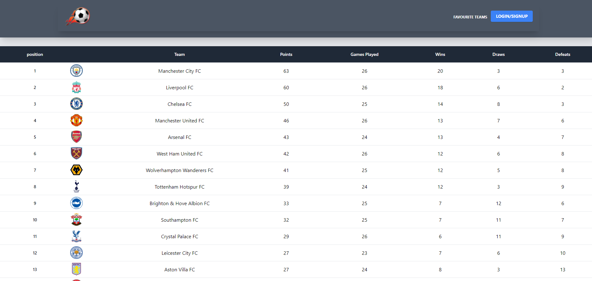

# Football-info-MERN-app

Gets the latest statistics on football leagues around the world

```
Football-info provides football data and statistics (live scores, fixtures, tables, squads, lineups/subs, etc.) in a machine-readable way for the top leagues around the world.
I won't announce how awesome football-info is, you're welcome to find out by yourself. Access to the top football competitions is and will be free forever as this was the initial purpose to set up the project.

```

## Table of Contents

- [Mockup](#mock-up)

- [Installation](#installation)

- [UserStory](#user-story)

- [Technologies](#technologies)

- [webpages](#webpages)

## Mock-Up

The following animation show a mock-up of the app and functionality:



## Installation

```bash
npm i
npm run install
npm run develop
```

## User Story

```
1. AS a user when I open the application I’m presented with a homepage

2. WHERE I’m given the option to log in, OR join a quiz as a guest.

3. IF I select Log in and I am not logged in I'm prompted to create an account.

4. To create a user I will be prompted for a password, email and Username.

5. To Log In I will need to give my username or email and password.

6. WHEN I log in I’m presented with a page where I search for quizzes.

7. Once I've chosen to join as a guest or a user I can search for a quiz.
    7.1. Criteria to search for quiz
8. IF I’ve logged in I can click "my account".

9. IF I click my account, I can view my scores, teams and quizzes.
    9.1 Once I click on my scores ..
    9.2 Once I click on my teams ...
    9.3 Once I click on my quizzes
        9.3.1 I can add a quiz
        9.3.2 IF I click on an existing quiz, I've given the option to add a question or remove a question

10. Once I’ve selected a quiz I'm taken to a page where I can join  make a new team, join an existing team, or take the quiz on my own.
    10.1 IF I create a team I'm then prompted to add a team name.
        10.1.2 I'm then taken to a page where I wait for other users to join my team
        10.1.3 Once A user joins my team I can accept or reject them.
            10.1.2 WHEN ANOTHER user has joined my team I have the option to take the quiz wait for ANOTHER user.
    10.2.1 IF I select join an existing team, I then wait for my request to be accepted. 3=
        10.2.2. IF my application is accepted I'm taken to a page where I can see the other team members user names.
        10.2.3 IF my request is reject I'm told I must select another team and I'm returned to a screen where I can see all active teams and their team names
    10.3.1 IF I select to take the quiz on my own, I'm then taken to a waiting screen to wait for the quiz to start.
```

## Technologies


## WebPages

- the URL to Heroku: https://football-info-pa.herokuapp.com/

- the URL to the Github repository: https://github.com/odders17/Football-info-MERN-app
